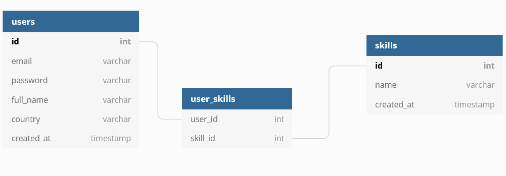

# Python Rest API with JWT

You need to have installed **Python (3+)** and **virtualenv** in order to run this api locally.

Also, need **MongoDB** as db.

> To handle the db uri, create a _.env_ file and follow the **.env.example** instructions.

## Installation

- Clone the repo `git clone https://github.com/stylessh/py-jwt-api.git`.
- Get inside the folder.
- Activate virtualenv `source env/bin/activate`.
- Install packages `pip install -r requirements.txt`.
- Now you can run the app `python main.py`.

## DB schema

## Endpoints

- User register with their own information **(POST /api/user/register _return HEAD token_)**.
- User login using JWT **(POST /api/user/login _return HEAD token_)**.
- Skills creation **(POST /api/skills/register _HEAD token_)**.
- Skill assignment **(POST /api/user/skills _HEAD token_)**.

- User Profile **(GET /api/user/profile _HEAD token_)**

> I recommend a Rest client app to test this API, as [Insomnia](https://insomnia.rest).
